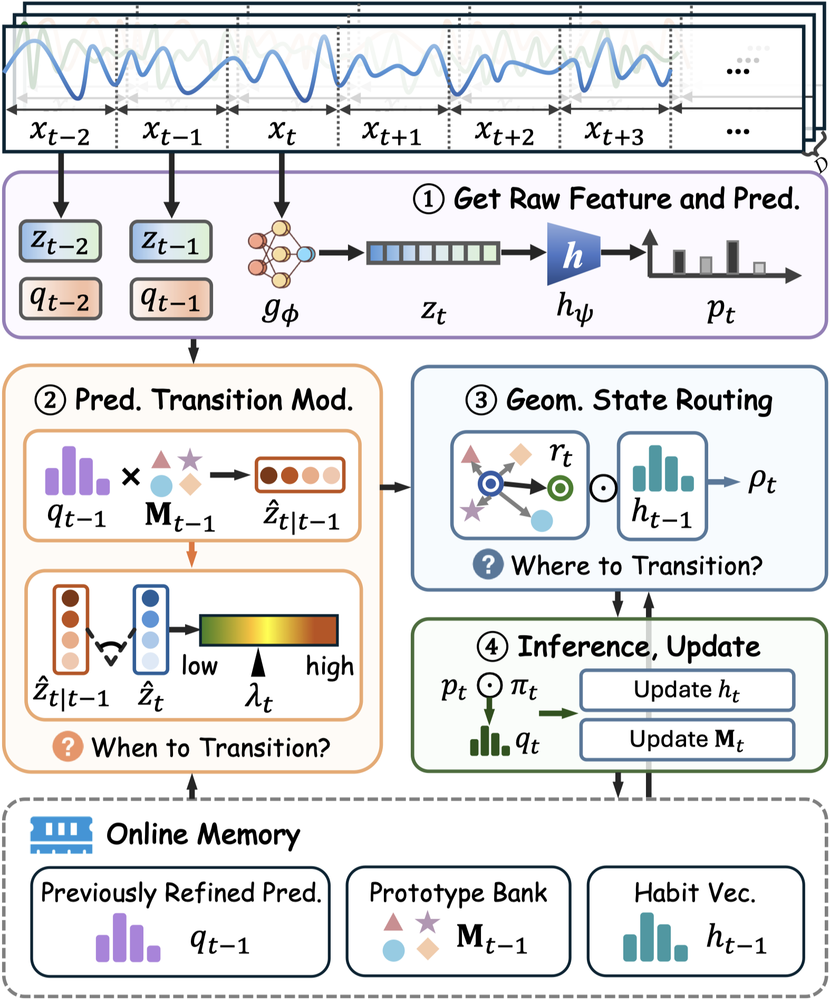

# ⌚️ SIGHT

Temporal Structure Matters for Efficient Test-Time Adaptation in Wearable Human Activity Recognition.

## Abstract

Wearable human activity recognition (WHAR) models often suffer from performance degradation under real-world cross-user distribution shifts. Test-time adaptation (TTA) mitigates this degradation by adapting models online using unlabeled test streams, yet existing methods largely inherit assumptions from vision tasks and underexploit the inherent inter-window temporal structure in WHAR streams. In this paper, we revisit such temporal structure as a feature-conditioned inference signal rather than merely an output-space smoothing prior. We derive the insight that temporal continuity and observation-induced feature deviations provide complementary cues for determining when to preserve or release temporal inertia and where to route prediction refinement during likely transitions. Building upon this insight, we propose **SIGHT**, a lightweight and backpropagation-free TTA framework for WHAR, enabling real-time edge deployment. SIGHT estimates predictive surprise by comparing the current feature with a prototype-based expected state, and then uses the resulting feature deviation to guide geometry-aware transition routing based on prototype alignment and stream-level marginal habit tracking. Evaluations on real-world datasets confirm that SIGHT outperforms existing TTA baselines while reducing computational and memory costs.

<p align="center">
    
</p>

## Environmental Setup

```bash
pip install torch numpy scikit-learn
```

## Data Acquisition

Download preprocessed `.npz` files from [[Google Drive - SIGHT-preprocessed-data]](https://drive.google.com/drive/folders/1tqDrggsd89mJ8FmDKNvipRWYhP9D13WN?usp=drive_link) and place them under `data/`.

Each `.npz` contains `x` (windows, channels, length) and `y` (string labels).

## Usage

### Running Commands

**Source training**
```bash
python run.py --phase source_training --data data/harth --source S006 --num-classes 5 --labels "cycling_like,lying,sitting,standing,walking_like"
```

**Test-time adaptation**
```bash
python run.py --phase tta --data data/harth --source S006 --target S032 --ckpt outputs/source_cnn.pt --num-classes 5
```

### Configuration Items

All hyperparameters are set via `argparse` in `run.py`:

| Arg | Default | Description |
|---|---|---|
| `--eta-mu` | 0.005 | Prototype evolution rate |
| `--omega-mu` | 0.01 | Source-prototype anchor rate |
| `--beta` | 1.0 | Surprise sensitivity |
| `--eta-h` | 0.05 | Habit-vector learning rate |
| `--tau` | 0.05 | KVA temperature |
| `--epochs` | 100 | Source training epochs |
| `--lr` | 0.001 | Source training learning rate |
| `--batch-size` | 64 | Source training batch size |

Model architecture (channels, kernel sizes, etc.) is also configurable via CLI args.
